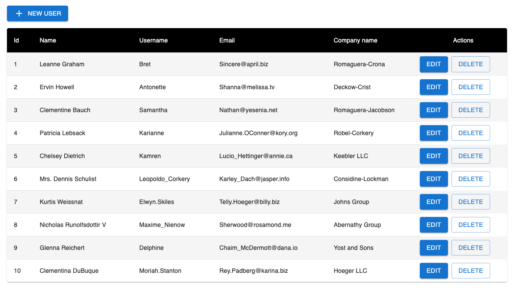
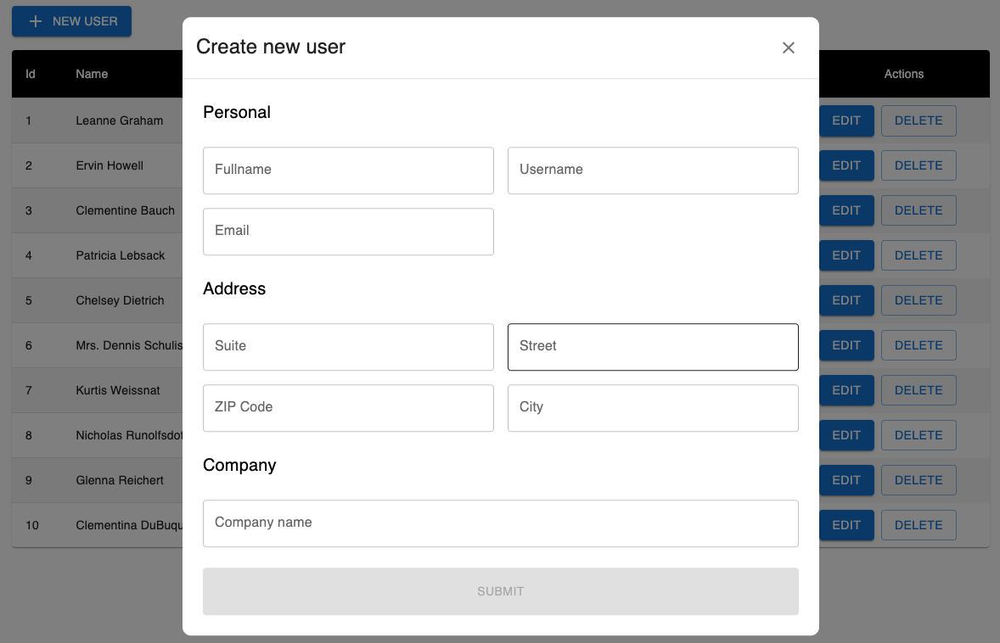

**You can view the site here: [Click Me](https://json-placeholder-task.vercel.app/)**

# About

This is a simple web application that fetches and displays a list of users from a public JSONPlaceholder API. The application supports all CRUD operations - create, read, update, delete.

## Tech Stack

- **Frontend:** React, Typescript, Redux
- **Styling:** MUI

## Getting Started

1. Clone this repository to your local computer.
2. Create a `.env` file in the root directory.
3. Add the following content to the `.env` file:
   ```
   VITE_APP_API_URL=https://jsonplaceholder.typicode.com/
   ```
4. Open a terminal in the root directory and run `npm install` or `yarn install`.
5. Once the installation is complete, you can start the app by running `npm run dev` or `yarn dev`.

## Getting Started with Docker

1. Clone this repository to your local computer.
2. Install and set up Docker Desktop.
3. Build a Docker image using the following command:
   ```
   docker build -t your-image-name .
   ```
   Replace `your-image-name` with the desired name for your Docker image (e.g., `json-placeholder`).
4. Run the Docker image:
   ```
   docker run -p 8080:8080 -d your-image-name
   ```
   Replace `your-image-name` with the desired name for your Docker image (e.g., `json-placeholder`).
5. Run the `docker-compose.yml` file:
   ```
   docker compose up
   ```

## Screenshots

<h3>Get Users</h3>



<h3>Add user</h3>

